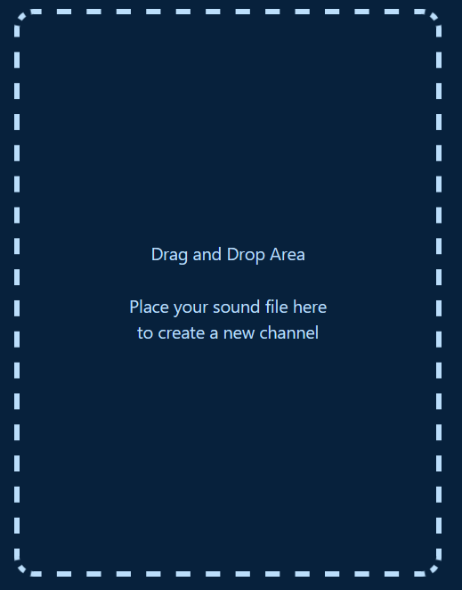
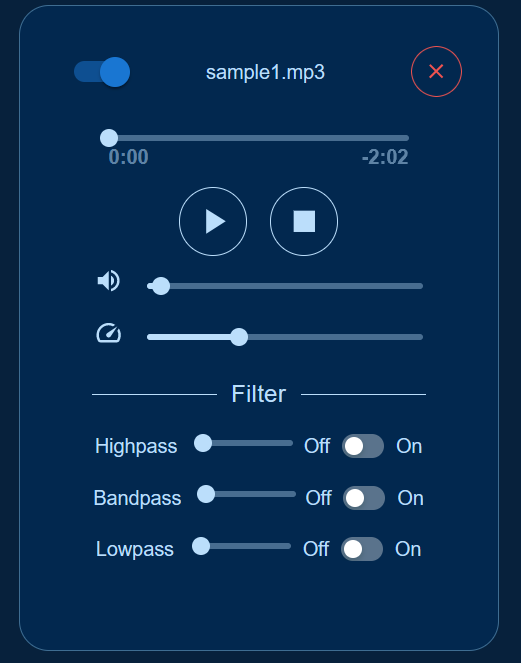
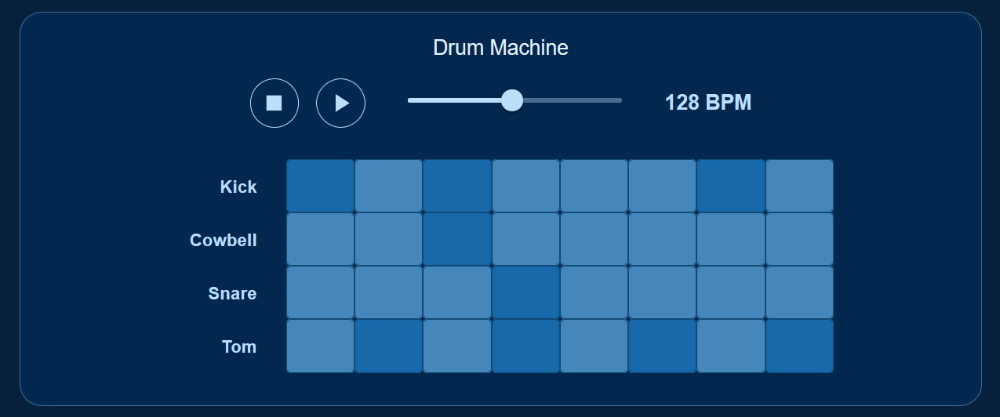
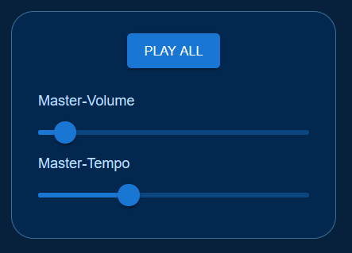

# React Audio FX Tool

Dies ist eine Projektarbeit im Rahmen des Kurses "Audio & Videotechnik", mit der mittels React Web-App Audiodateien und eine Drum-Machine gesteuert werden können.

## Verwendete Frameworks und Libraries

- React
- Web Audio API
- Material UI

## Features

- Drag and Drop von Audiofiles 
    - unterstützte Formate: wav, mpeg (mp3), ogg, x-ms-wma
- Bis zu vier verschiedene Audio-Channels
    - je Channel diverse Funktionen:
        - Abspielen & Pausieren einer Soundfile
        - Wiedergabe-Steuerung während des laufenden Tracks
        - zeitliche Darstellung der Trackdauer und verbleibender Zeit
        - Lautstärkeregelung
        - drei Filter (Lowpass, Bandpass, Highpass) die jeweils an- bzw. ausgeschaltet werden können
        - Löschen eines Channels
- Masterchannel zur Steuerung von Lautstärke und Geschwindigkeit sowie Wiedergabe oder Pausieren aller Elemente (bis zu vier Channels, Drum-Machine(nur Lautstärke))
- Anbindung eines externen Midi-Controllers
- Drum-Machine
    - vier verschiedene Tracks (Kick, Cowbell, Snare, Tom)
    - je Track 8 Notes ein- und ausschaltbar
    - Wiedergabe, Pausieren und Stoppen der Machine 
    - BPM-Steuerung

## Setup

### Midi Controller
- WICHTIG! Der Midi Controller funktioniert nur in Google Chrome.
- Die Anwendung verwendet ein "Behringer cmd mm-1" Midi Module als externen Midi-Controller
- Jede Spalte von Knöpfen und Reglern gehört zu einem Channel:
  - Die ersten drei Drehknöpfe von oben nach unten steuern den jeweiligen Gain eines Filters (Highpass, Bandpass, Lowpass).
  - Der vierte Drehknopf steuert die Abspielgeschwindigkeit des Channels.
  - Der "Cue" Knopf bedient den Play/Pause Button.
  - Der Regler der Spalte steuert die Lautstärke des Channels.
- Steuerung vom Master:
  - Der Drehknopf "out 1" steuert die Master Abspielgeschwindigkeit. 
  - Der unterste horizontale Regler steuert die Master Lautstärke.
- Jedem Channel wird automatisch ein Kanal auf dem externen Midi-Controller zugewiesen
  - Der erste Channel von links in der App wird dem ersten Kanal von links auf dem Midi-Controller zugewiesen usw.

### lokale Installation
 1. Git-Repo in lokales Verzeichnis clonen
 2. in Terminal "npm i" eingeben um alle Dependencies lokal zu installieren
 3. "npm start" in Terminal eingeben um Browser-Anwendung auf localhost zu starten

## Anleitung zur Nutzung
- Channels
  - Um einen neuen Audiochannel zu erzeugen, muss man Audiodateien im entsprechenden Format (s.o.) in die "Drag-and-Drop Area" (Siehe unten) ziehen. Es können maximal 4 Channels in der App erzeugt werden und funktionieren nebeneinander.

    
  - Ein Channel besteht aus:

    
    
    - Oben links: Der Schalter aktiviert bzw. deaktiviert den Channel.
    - Oben rechts: Das rote Kreuz löscht den Channel.
    - Oberste Regler: Zeigt den aktuellen Zeitpunkt der Audio-Datei. Man kann den Regler zu einem gewünschten Zeitpunkt schieben.
    - Play Knopf: Der Knopf dient zum Abspielen und Pausieren.
    - Stop Knopf: Stoppt die Audio-Wiedergabe und setzt den aktuellen Zeitpunkt auf 0:00.
    - Regler neben dem Lautsprecher Icon: Steuert die Lautstärke vom Channel. Der Regler kann mit der Mouse oder mit dem Midi gesteuert werden.
    - Regler neben dem Tempo Icon: Steuert die Geschwindigkeit der Audio-Wiedergabe. Mit dem Regler kann die Wiedergabe zwischen 0 bis 3-facher Geschwindigkeit geregelt werden.
    - Filter: 3 Arten von Filter sind für jeden Channel verfügbar. Highpass, Bandpass und Lowpass.
      - Zu jedem Filter gehört ein Regler, der die Stärke des gefilterten Signals steuert.
      - Rechts neben jedem Filter ist ein Schalter, der die Filter aktiviert bzw. deaktiviert. 
      - Wenn kein Filter aktiviert ist, spielt das Audio ungefiltert. Wenn ein oder mehrere Filter aktiviert sind, werden nur die Signale der aktivierten Filter mit ihrer zugehörigen Filterstärke gespielt.

- Drum-Machine

    
  
  - Die Drum-Machine besteht aus vier Tracks mit jeweils 8 Notes
  - Die bestehenden Tracks sind Kick, Cowbell, Snare und Tom, 
  - Die Tracks können auf Wunsch innerhalb der useNoteContext.js (src/components/DrumMachine/hooks) gewechselt werden
  - Dabei muss einfach der Index des audioClips Arrays angepasst werden in Codezeile 44 - aktuell: 0
    ` const [clips, dispatch] = useReducer(appReducer, { ...audioClips[0] })`
  - Der Index bezieht sich auf const audiofiles innerhalb der audioclips.js-File (Zeile 1 - src/components/DrumMachine/)
  - Die Dateipfade der Trackfiles befinden sich innerhalb der const soundfiles ab Zeile 66 in derselben audioClips.js 
  - Jede Note kann individuell an- bzw. ausgeschaltet werden
  - Nach Drücken des Play-Buttons werden von links nach rechts die aktivierten Notes abgespielt
  - Der Play-Button wechselt nach Wiedergabe automatisch zu einem Pause-Button, mit dem die Wiedergabe an dem aktuellen Wiedergabezeitpunkt pausiert werden kann.
  - Die Wiedergabe kann dann nach Wunsch von demselben Zeitpunkt fortgeführt werden
  - Der Clipheader zeigt dabei an welche Notes zum aktuellen Wiedergabezeitpunkt abgespielt werden
  - Mit der Stop-Taste kann die Wiedergabe der kompletten Drum-Machine gestoppt werden, die aktuelle Zeit wird auf 0 gesetzt

- Master

  

  - Der Knopf startet bzw. pausiert alle Channels.
  - Der "Master-Volume" Regler steuert die Lautstärke der ganzen Anwendung.
  - Der "Master-Rate" Regler steuert die Geschwindigkeit aller Channels. Dies beeinflusst nicht die BPM der Drum-Machine.
  
## Empfohlene weitere Schritte

Mit etwas mehr Zeit könnten folgende Features folgen:
- Visualisierung der Audiodaten einzelner Channels
- Dropdown Menü zur Auswahl von weiteren Drum-Machine-Samples
- Light / Dark-Theme Switch